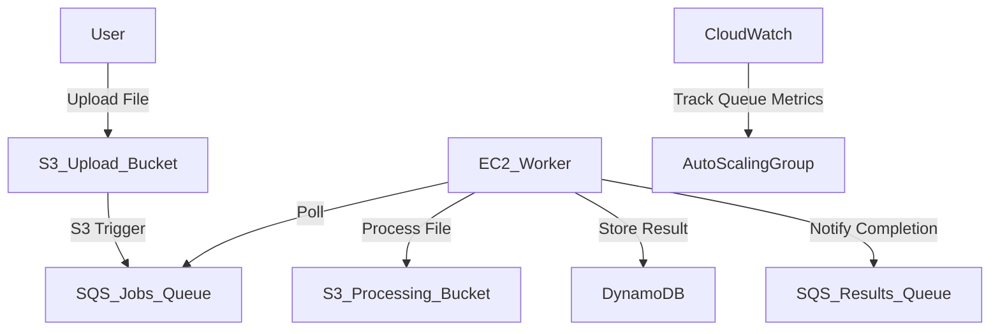

# 📊 WordFreq – Scalable Text Processing System on AWS

> ⚡ A production-ready, auto-scaling text analytics platform using AWS services to process large-scale file uploads and extract top word frequencies.

---

## 🌐 Overview

**WordFreq** is a cloud-native, event-driven system that automatically analyzes text files uploaded to S3, extracting and ranking the top 10 most frequent words in each file. Designed using scalable, distributed architecture patterns, the project leverages AWS services including EC2, SQS, S3, DynamoDB, and CloudWatch for monitoring and autoscaling. The platform enables real-time processing pipelines for educational, professional, or enterprise-grade workloads.

---

## 🪄 Key Features

- 🔁 **Serverless Ingestion via S3**  
  Seamless user upload triggers processing without manual intervention.

- 📬 **Queue-Driven Architecture**  
  SQS queues decouple processing jobs and results, enabling fault tolerance and modular scaling.

- 📈 **Auto Scaling Based on Load**  
  EC2 worker fleet scales dynamically in/out based on message volume in job queue (CloudWatch-based).

- ⚙️ **Stateless, Distributed Workers**  
  Worker nodes are stateless Go services designed for high availability and parallel file processing.

- 🧠 **Top 10 Word Frequency Analysis**  
  Efficient algorithm to identify most common words across text files, storing structured output in DynamoDB.

- 🗂️ **Result Persistence**  
  All processed results are persisted with job IDs, word counts, and timestamps for future retrieval and monitoring.

- 📊 **Performance Benchmarked**  
  Load tested across multiple instance types with metrics collected for performance tuning.

- 🔒 **IAM-Secured Architecture**  
  Fine-grained access control via IAM roles scoped to specific AWS services only.

- 🧪 **Replay-Friendly Design**  
  Jobs remain in queue until explicitly completed, ensuring no lost processing on worker failure.

---

## 💡 Use Cases

- Real-time file processing system for enterprise apps  
- Serverless MVP to demonstrate AWS decoupled microservices  
- Teaching resource for cloud-based infrastructure deployment  
- Benchmark framework for EC2 auto scaling and performance metrics  

---

## 🏗️ AWS Services Used

| Service         | Purpose                                                  |
|------------------|-----------------------------------------------------------|
| **Amazon S3**     | File upload, persistence and input/output storage        |
| **Amazon SQS**    | Distributes jobs between services (Jobs & Results Queues)|
| **Amazon EC2**    | Hosts auto-scalable processing workers (written in Go)   |
| **CloudWatch**    | Monitors job queue metrics and manages scaling triggers  |
| **Auto Scaling**  | Automatically increases/decreases EC2 instances          |
| **DynamoDB**      | Stores final results of each processed file              |
| **IAM**           | Ensures secure service interactions with limited roles   |

---

## 📸 System Architecture


## ⚙️ Getting Started

Follow the steps below to set up and deploy the WordFreq system on your AWS account.

---

### 🔧 Prerequisites

- ✅ AWS CLI installed and configured  
- ✅ AWS IAM credentials with access to:
  - EC2
  - S3
  - SQS
  - DynamoDB
  - IAM
  - CloudWatch  
- ✅ Golang installed (for local development or EC2 workers)

---

### 🛠 Infrastructure Setup

#### 1️⃣ Create S3 Buckets

- `uploading-bucket` — where users upload raw `.txt` files  
- `processing-bucket` — where processed files are stored (optional, for archival)

#### 2️⃣ Set Up SQS Queues

- `jobs-queue` — used for dispatching file processing jobs  
- `results-queue` — receives confirmation after job completion

#### 3️⃣ Create DynamoDB Table

- Table Name: `wordfreq-results`  
- Primary Key: `job_id` (String)

#### 4️⃣ IAM Role for EC2

Create an IAM role and attach policies for:

- `AmazonS3FullAccess`
- `AmazonSQSFullAccess`
- `AmazonDynamoDBFullAccess`
- `CloudWatchAgentServerPolicy`

Assign this IAM role to your EC2 instance.

#### 5️⃣ EC2 Configuration

- Launch an EC2 instance with:
  - IAM Role (above)
  - Security Group with outbound internet access
  - User data to install Go (or use an AMI with Go preinstalled)

#### 6️⃣ Auto Scaling Group (ASG)

- Use EC2 launch template as ASG base
- Auto Scaling policies:
  - Scale out: `ApproximateNumberOfMessagesVisible > 25`
  - Scale in: `ApproximateNumberOfMessagesVisible < 5`
- Cooldown period: 50 seconds

---

### 🚀 Running the Worker

#### Clone the Repository

```bash
git clone https://github.com/your-username/wordfreq.git
cd wordfreq
